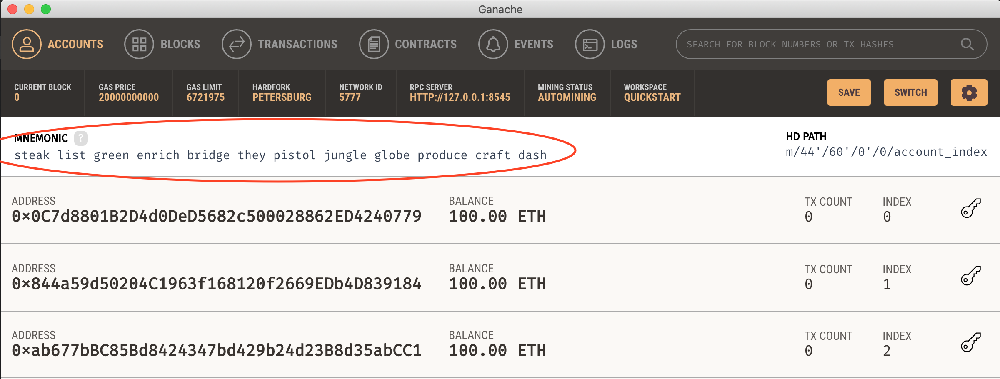
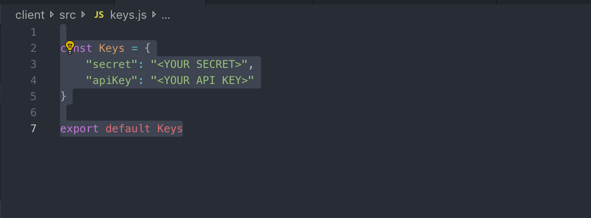

# Shy Panda
It’s an Ethereum blockchain project with the purpose of collecting funds for animal protection organizations around the world, with emphasis in developing countries.

### Motivation
Non-profit animal protection organizations usually have a hard time when collecting funds for their everyday functions. In developing countries, where they sadly have little or no support from the government or other entities, they rely on the goodwill of donors and small activities to keep the organization afloat. Making use of Ethereum, I want to help to change this; allowing people from all over the world to make donations, with almost no fees on the cases they find most urgent, and at the same time allowing them to get updates from the organizations so they have the certainty that good deeds are made with their donation.

### How-to Run
In order to run the project you will need:
- Ganache or ganache-cli installed on your system
- `npm` or `yarn` to run the front end
- A [Pinata](https://pinata.cloud/signup) API key/Secret pair
0. Clone the project in your local machine and cd into it
1. After making sure you got these you must start a Ganache instance, either using the CLI or the graphic interface. And get the mnemonic from it:

2. Go to the project root folder and create a file called `.secret`, paste the mnemonic in there.
3. Run the migrations command from the project root folder:
```
truffle migrate --network development
```
    3a. Since the client already includes the ABI pointing to the Rinkeby deployed contracts, you will need to replace them with the ABIs you just created. Go to the project root and copy the contents of the `build/contracts/` folder, into `client/src/contracts` (They should be 4 contract ABIs).
4. Now import the mnemonic into Metamask.
5. You will need a Piñata API/Secret pair to be able to submit pets.
    5a. Go to [Pinata](https://pinata.cloud/signup) and create an account in case you don’t have one yet.
    5b. Go to [you account page](https://pinata.cloud/account) and grab the API Key and Secret from there.
	5c. Paste these values in the `client/src/keys.js` file 
    
6. From the project root folder, `cd` into the client folder and run:
`npm start` or `yarn start`
7. From a web browser navigate to `localhost:3000`
8. Making sure you are using in Metamask the same account you used to deploy the contract in truffle (should be Account 1) navigate to `Add Organization`, from here you can allow an address to submit pets to the contract. Give a name to the organization in the `Name` input and paste one of the other accounts available in Ganache or Metamask in the `Address` input. Click Submit.
9. Select in Metamask the account you used in the step above and navigate to `Add Pet`. You will be able to submit pets that will accept donations, enter the information along with some photos for the pet and click Submit.
10. Using any other account in Metamask, navigate to `Make a Good Deed`. You should be able to see the pet you just submitted using the organization address. From here you can click in `Donate` to make a new donation for this pet and see how the progress is increased towards the goal.
11. Now going back to the organization address you can navigate to `Withdraw` in here you should be able to see the amount you donated in the step above, available for the organization to withdraw it. Click on `Withdraw` and confirm the transaction, your ether should increase by the same amount.